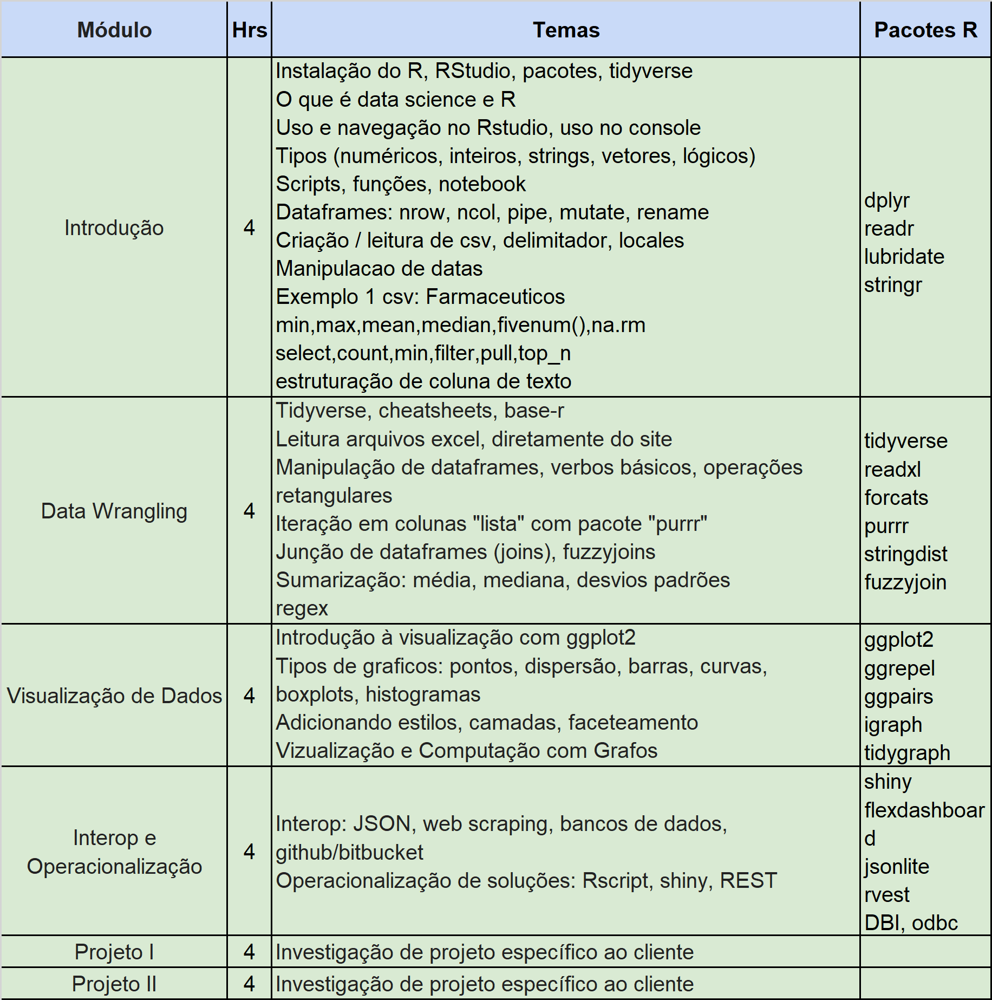

<!-- README.md is generated from README.Rmd. Please edit that file -->

```{r, echo = FALSE}
knitr::opts_chunk$set(
  collapse = TRUE,
  comment = "#>"
)
```

```{r,eval=T,echo=F,out.width='33%'}

```

* Organizador: Daniel Lima Ribeiro (MP-RJ), daniel@mprj.mp.br
* Professor: [Dan S. Reznik (PUC-CCE)](https://www.linkedin.com/in/dan-s-reznik-phd-bb49133/), dan@upperwestsolucoes.com
* Monitores
    + [Matheus Donato (ENCE/IBGE)](https://www.linkedin.com/in/matheus-donato-75526388/), donats.donato@gmail.com
    + Thomás Jagoda (UFRJ), thomasjagoda@poli.ufrj.br

## Notebook recomendado

* CPU i3 (6a geração ou melhor), RAM >=  4Gb, Windows10  
* Tela: 14” (ou maior) e "full HD" (1920x1080). Evitar telas HD “puro” (720p)
* Exemplo: [Samsung Essentials E30](https://www.americanas.com.br/produto/133794107)

## Downloads p/ Windows10

* [R 3.5.3](https://cran.r-project.org/bin/windows/base/)
* [RStudio 1.1.463](https://download1.rstudio.org/RStudio-1.1.463.exe)
* [Git](https://git-scm.com/download/win)
* [Notepad++](https://notepad-plus-plus.org/download/v7.6.4.html)

## Pós-Instalação

* Instalar pacote “tidyverse” executando no cmd prompt:
    + `R -e "install.packages('tidyverse',repo='https://cloud.r-project.org')"`
* Versionamento
    + Criar conta no GitHub
    + Fork: https://github.com/dan-reznik/R-Ministerio-Publico-RJ
    + Executar na tela de comando do windows:
        + `git config --global user.email "<seu_mail>@<...>.com"`
        + `git config --global user.name "<seu nome>"`
    + No RStudio, criar chaves de segurança SSH
    + No cmd prompt executar:
        + `git config remote.origin.url git@github.com:<user>/<projname>.git`

## Livros Online (grátis)

* <span style="background-color: #FFFF00">H. Wickham & G. Grolemund </span>, ["R for Data Science" (r4ds)](https://r4ds.had.co.nz/)
* Kieran Healy, ["Data Visualization"](https://socviz.co/)
* Garrett Grolemund, ["Hands-on Programming with R"](https://rstudio-education.github.io/hopr/)
* Claudia Engel, ["Data Wrangling with R"](https://cengel.github.io/R-data-wrangling/)
* Jenny Bryan, [Happy Git and GitHub for the useR"](https://happygitwithr.com/)
* Yihui Xie et al., ["Blogdown: Creating Websites with R Markdown"](https://bookdown.org/yihui/blogdown/)
* Max Kuhn, ["Applied Predictive Modeling"](http://appliedpredictivemodeling.com/)
* Max Kuhn, ["Feature Engineering and Selection: A Practical Approach for Predictive Models"](https://bookdown.org/max/FES/)
* Mark Sellors, ["Field Guide to the R Ecosystem"](https://fg2re.sellorm.com/)

## Vídeos dos “Mestres”

* Hadley Wickham, ["Whole Game"](https://www.youtube.com/watch?v=go5Au01Jrvs)
* David Robinson, ["Tidytuesdays"](https://www.youtube.com/user/safe4democracy/videos) 

## Sites Úteis

* Tidyverse
    + [Pacotes](https://www.tidyverse.org/packages/)
    + [Cheatsheets](https://www.rstudio.com/resources/cheatsheets/)
    + [Regular Expressions](https://stringr.tidyverse.org/articles/regular-expressions.html)
* Pacotes R
    + [Leaderboard](https://www.rdocumentation.org/trends)
    + [Task Views](https://cran.r-project.org/web/views/)
    + [Awesome R](https://awesome-r.com/)
* Blogs
    + [R-Bloggers](https://www.r-bloggers.com/)
    + Hadley Wickham, ["Como se tornar um Cientista de Dados"](https://gist.github.com/hadley/820f09ded347c62c2864)
* Version Control
    + [Rstudio & Git](https://support.rstudio.com/hc/en-us/articles/200532077-Version-Control-with-Git-and-SVN)
    + Karl Broman, ["Github tutorial"](http://kbroman.org/github_tutorial/)
    + Michael Freedman, ["Git Collaboration"](http://slides.com/michaelfreeman/git-collaboration)
    
## Plano de Aulas (sujeito à alterações)

```{r,eval=T,echo=F,out.width='50%'}

```
    
## Projeto 1: Execução Orçamentária

* Estudo exploratório:
    + Quais pastas estão sendo mais pagas
    + Quais modalidades de licitação
    + Com qual frequência de dispensa
    + Por área de governo etc.
* Pasta de Saúde:
    + Esta pasta recebe menos recursos do que as demais?
    + Gastos em outras áreas são mais ou menos prioritários?
* Fonte: [Portal de Transparência Fiscal](http://www.transparencia.rj.gov.br/transparencia/faces/OrcamentoTematico/despesa)
* GitHub: https://github.com/dan-reznik/MP-Execucao-Orcamentaria
